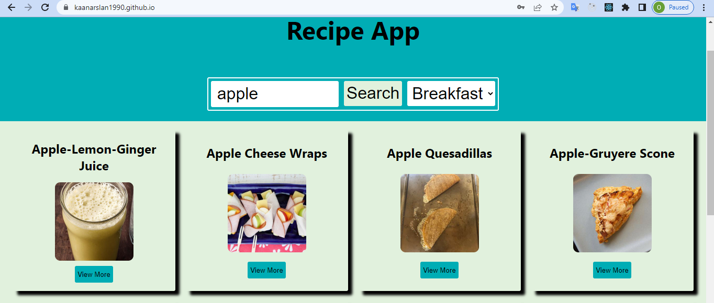

# Project Recipe App 

## Description

Project aims to create a Recipe App.

## Problem Statement

- Adding a new project to my portfolio. 

## Expected Outcome

## Objective

Build a Recipe App using ReactJS.

### At the end of the project, following topics are to be covered;

- HTML

- CSS

- JS

- ReactJS

### At the end of the project, I will be able to;

- improve coding skills within HTML & CSS & JS & ReactJS.

- use git commands (push, pull, commit, add etc.) and Github as Version Control System.

**
&#9786; Happy Coding &#9997;
**
